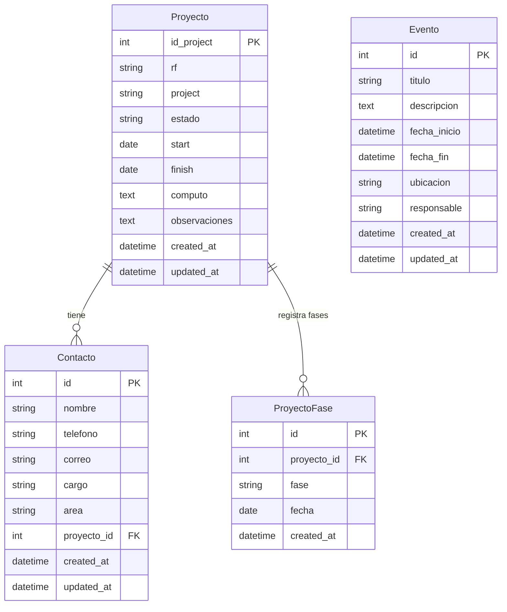

# Proyecto Control - App Web

Esta es una aplicación web para la gestión y visualización de proyectos, migrada desde una versión inicial en Flask a una arquitectura más robusta y escalable con Django y MySQL.

## 📁 Estructura del Proyecto

```
proyecto_control/
├── control_proyectos/          # App Django principal
│   ├── models.py              # Modelos de datos
│   ├── views.py               # Vistas y lógica de negocio
│   ├── admin.py               # Configuración de admin
│   └── urls.py                # URLs de la app
├── proyecto_control/          # Configuración del proyecto Django
│   ├── settings.py            # Configuración de Django
│   ├── urls.py                # URLs principales
│   └── wsgi.py                # WSGI configuration
├── scripts/                   # Scripts de utilidad y mantenimiento
│   ├── migrate_excel_to_mysql.py    # Migración desde Excel
│   ├── test_*.py                    # Scripts de prueba
│   ├── check_*.py                   # Scripts de verificación
│   └── debug_*.py                   # Scripts de debug
├── config/                    # Archivos de configuración
│   └── settings.json          # Configuración general
├── static/                    # Archivos estáticos (CSS, JS, imágenes)
├── templates/                 # Plantillas HTML
├── manage.py                  # Script de gestión de Django
├── requirements.txt           # Dependencias Python
└── README.md                  # Este archivo
```

## 1. Descripción General

La aplicación `Proyecto Control` ofrece un dashboard interactivo para monitorear el estado de múltiples proyectos. Permite visualizar estadísticas, filtrar y buscar proyectos, así como gestionar detalles específicos de cada uno y programar eventos.

La migración a Django se realizó para mejorar la integridad de los datos (pasando de archivos Excel a una base de datos MySQL), la escalabilidad y la mantenibilidad del código.

## 2. Características Principales

-   **Dashboard Interactivo:** Gráfico de proyectos iniciados por mes y contadores de estado.
-   **Tabla de Proyectos:** Paginación, búsqueda en tiempo real y filtros por año, mes y fase (Finalizado/No Finalizado).
-   **Gestión de Proyectos (CRUD):**
    -   Crear nuevos proyectos.
    -   Ver detalles completos de cada proyecto en un modal.
    -   Editar toda la información de un proyecto.
-   **Seguimiento de Fases:** Registro histórico de las fases de cada proyecto (Despliegue, Entregado, Operación) con sus fechas correspondientes.
-   **Gestión de Eventos (CRUD):**
    -   Widget flotante para visualizar, crear, editar y eliminar eventos del calendario.
-   **📋 Libreta de Contactos:** Widget completo para gestión de contactos con las siguientes funcionalidades:
    -   **Gestión Completa (CRUD):** Crear, ver, editar y eliminar contactos.
    -   **Búsqueda Avanzada:** Búsqueda case-insensitive, sin acentos, y multi-palabras que busca en todos los campos.
    -   **Búsqueda Global:** Busca en todas las páginas de contactos, no solo en la visible.
    -   **Paginación Inteligente:** Navegación entre páginas con mantenimiento del estado de búsqueda.
    -   **Integración con Proyectos:** Asociar contactos a proyectos específicos.
    -   **Comunicación Directa:** Botones para chatear en Teams y enviar correos directamente.
    -   **Estado Persistente:** Mantiene búsqueda y página actual después de editar/eliminar contactos.
    -   **Formulario Limpio:** Siempre abre formulario en blanco para nuevos contactos.
-   **Resumen de Pendientes:** Una tabla que extrae y resume todas las tareas con estado "Pendiente" o "En curso" de los proyectos no finalizados.
-   **Generación de Informes con IA:** Funcionalidad para generar un análisis del estado de los proyectos en curso utilizando la API de Google Gemini.
-   **Autenticación de Usuarios:** Sistema de login para proteger el acceso a la aplicación.

## 📋 Widget: Libreta de Contactos

El widget de Libreta de Contactos es una herramienta integral para la gestión de contactos dentro de la aplicación, diseñada con una experiencia de usuario moderna y eficiente.

### 🏗️ Estructura del Widget

#### **Componentes Frontend:**
- **Contenedor Principal:** `#contacts-widget` con diseño temático IA
- **Barra de Búsqueda:** Input con búsqueda en tiempo real
- **Tabla de Contactos:** Diseño responsive con paginación
- **Modal de Gestión:** Formulario para crear/editar contactos
- **Botones de Acción:** Teams, Correo, Editar, Eliminar

#### **Componentes Backend:**
- **Modelo Contacto:** `models.Contacto` con campos completos
- **API REST:** Endpoints `/api/contacts/` para CRUD
- **Admin Django:** Interfaz administrativa para contactos

### ⚡ Funcionalidades Avanzadas

#### **🔍 Búsqueda Inteligente:**
- **Case-Insensitive:** No distingue mayúsculas/minúsculas
- **Sin Acentos:** Normaliza caracteres especiales (á, é, í, ó, ú → a, e, i, o, u)
- **Multi-palabras:** Busca combinaciones de palabras con lógica AND/OR
- **Búsqueda Global:** Busca en todas las páginas, no solo en la visible
- **Campos Buscados:** Nombre, teléfono, correo, cargo, área, proyecto

#### **📄 Paginación y Estado:**
- **Paginación Cliente:** 10 contactos por página
- **Estado Persistente:** Mantiene búsqueda y página después de operaciones CRUD
- **Navegación Fluida:** Botones anterior/siguiente con información de página
- **Mensajes Vacíos:** Información clara cuando no hay resultados

#### **🔄 Gestión CRUD:**
- **Crear:** Formulario limpio con validación
- **Leer:** Vista tabular con todos los datos
- **Actualizar:** Edición con preservación de estado
- **Eliminar:** Confirmación con actualización automática

#### **🔗 Integración y Comunicación:**
- **Asociación a Proyectos:** Campo `proyecto_id` para relacionar con proyectos
- **Botones de Comunicación:**
  - **Teams:** `msteams:/l/chat/0/0?users={correo}`
  - **Correo:** `mailto:{correo}`
- **Detalles de Proyecto:** Muestra contactos asociados en vista de detalles

#### **🎨 Experiencia de Usuario:**
- **Diseño Tema IA:** Gradientes púrpura con efectos glassmorphism
- **Animaciones Suaves:** Transiciones hover y micro-interacciones
- **Responsive:** Adaptable a móviles y tablets
- **Feedback Visual:** Estados de carga y mensajes de éxito/error

### 📊 Modelo de Datos

```python
class Contacto(models.Model):
    nombre = models.CharField(max_length=200)
    telefono = models.CharField(max_length=20, blank=True)
    correo = models.EmailField(blank=True)
    cargo = models.CharField(max_length=100, blank=True)
    area = models.CharField(max_length=100, blank=True)
    proyecto = models.ForeignKey(Proyecto, on_delete=models.SET_NULL, null=True, blank=True)
    notas = models.TextField(blank=True)
    fecha_creacion = models.DateTimeField(auto_now_add=True)
    fecha_actualizacion = models.DateTimeField(auto_now=True)
```

### 🔄 Flujo de Trabajo Típico

1. **Búsqueda:** Usuario escribe y ve resultados filtrados instantáneamente
2. **Navegación:** Pagina entre resultados manteniendo búsqueda activa
3. **Creación:** Presiona "Añadir Contacto" → formulario limpio → guarda
4. **Edición:** Presiona editar → modifica → guarda → vuelve a misma página/búsqueda
5. **Comunicación:** Presiona Teams/Correo → abre aplicación correspondiente
6. **Integración:** Al ver detalles de proyecto → ve contactos asociados con botones

### 🛠️ Aspectos Técnicos

#### **Frontend (JavaScript):**
- **Gestión de Estado:** `allContacts`, `contactsCurrentPage`, `currentSearch`
- **Normalización:** `toLowerCase()`, `normalize('NFD')`, `replace(/[\u0300-\u036f]/g, '')`
- **Renderizado Eficiente:** `renderContacts()` con DOM virtual
- **Event Delegation:** Manejo optimizado de eventos

#### **Backend (Django):**
- **Serializers:** Conversión JSON para API
- **ViewSet:** Lógica CRUD automatizada
- **Permisos:** Protección de endpoints
- **Validación:** Clean methods en modelo

## 3. Modelos de Datos

La aplicación utiliza cuatro modelos principales para gestionar la información de manera estructurada y relacional.

### 📊 **Modelo Proyecto**

Almacena toda la información de los proyectos del sistema.

```python
class Proyecto(models.Model):
    # Campos principales
    id_project = models.IntegerField(unique=True, verbose_name="ID Proyecto", db_index=True)
    rf = models.CharField(max_length=100, verbose_name="RF", blank=True, null=True)
    project = models.CharField(max_length=255, verbose_name="Proyecto", blank=True, null=True)
    project_leader = models.CharField(max_length=255, verbose_name="Líder de Proyecto", blank=True, null=True)
    
    # Estado y progreso
    estado = models.CharField(max_length=50, verbose_name="Estado", default="Despliegue", blank=True, null=True)
    
    # Fechas
    start = models.DateField(verbose_name="Start", blank=True, null=True)
    finish = models.DateField(verbose_name="Finish", blank=True, null=True)
    
    # Cómputo
    computo = models.TextField(verbose_name="Cómputo", blank=True, null=True)
    
    # Campos de estado/tareas pendientes (NTP, SCAN, etc.)
    ntp = models.CharField(max_length=100, verbose_name="NTP", default="Pendiente", blank=True, null=True)
    scan = models.CharField(max_length=100, verbose_name="SCAN", default="Pendiente", blank=True, null=True)
    resuelve_por_nombre = models.CharField(max_length=100, verbose_name="Resuelve por Nombre", default="Pendiente", blank=True, null=True)
    antivirus = models.CharField(max_length=100, verbose_name="Antivirus", default="Pendiente", blank=True, null=True)
    config_backup = models.CharField(max_length=100, verbose_name="Config Backup", default="Pendiente", blank=True, null=True)
    monitoreo_nagios = models.CharField(max_length=100, verbose_name="Monitoreo Nagios", default="Pendiente", blank=True, null=True)
    monitoreo_elastic = models.CharField(max_length=100, verbose_name="Monitoreo Elastic", default="Pendiente", blank=True, null=True)
    ucmdb = models.CharField(max_length=100, verbose_name="UCMDB", default="Pendiente", blank=True, null=True)
    conectividad_awx = models.CharField(max_length=100, verbose_name="Conectividad AWX 172.18.90.250 (SOLO UNIX)", default="Pendiente", blank=True, null=True)
    cambio_paso_operacion_ola = models.CharField(max_length=100, verbose_name="Cambio Paso Operación (OLA)", default="Pendiente", blank=True, null=True)
    
    # Campos técnicos adicionales
    base_de_datos = models.CharField(max_length=100, verbose_name="Base de Datos", blank=True, null=True)
    balanceo = models.CharField(max_length=100, verbose_name="Balanceo", blank=True, null=True)
    backup = models.CharField(max_length=100, verbose_name="Backup", blank=True, null=True)
    check_av = models.CharField(max_length=100, verbose_name="Check AV", blank=True, null=True)
    cantidad_maquinas = models.CharField(max_length=255, verbose_name="CANTIDAD MAQUINAS", blank=True, null=True)
    cod_serv_hostname = models.TextField(verbose_name="COD SERV_HOSTNAME", blank=True, null=True)
    plataforma = models.CharField(max_length=255, verbose_name="PLATAFORMA", blank=True, null=True)
    so = models.CharField(max_length=255, verbose_name="SO", blank=True, null=True)
    windows_licencia_activada = models.CharField(max_length=100, verbose_name="WINDOWS LICENCIA ACTIVADA", blank=True, null=True)
    dominio = models.CharField(max_length=255, verbose_name="DOMINIO", blank=True, null=True)
    plataforma_backup = models.CharField(max_length=255, verbose_name="PLATAFORMA BACKUP", blank=True, null=True)
    proveedor = models.CharField(max_length=255, verbose_name="PROVEEDOR", blank=True, null=True)
    comunidad_snmp = models.CharField(max_length=255, verbose_name="COMUNIDAD SNMP", blank=True, null=True)
    fgn_172_22_16_93 = models.CharField(max_length=100, verbose_name="FGN 172.22.16.93", blank=True, null=True)
    rt = models.CharField(max_length=255, verbose_name="RT", blank=True, null=True)
    servicio = models.CharField(max_length=255, verbose_name="SERVICIO", blank=True, null=True)
    observaciones = models.TextField(verbose_name="OBSERVACIONES", blank=True, null=True)
    
    # Metadatos
    created_at = models.DateTimeField(auto_now_add=True, verbose_name="Fecha de Creación")
    updated_at = models.DateTimeField(auto_now=True, verbose_name="Fecha de Actualización")
```

**Características del Modelo Proyecto:**
- ✅ **ID único**: `id_project` como identificador principal
- ✅ **Índices optimizados**: En `id_project`, `estado`, `start`
- ✅ **Campos de estado**: 11 campos diferentes para seguimiento de tareas
- ✅ **Información técnica**: Plataforma, SO, dominio, proveedor
- ✅ **Metadatos automáticos**: Fechas de creación y actualización

### 📅 **Modelo Evento**

Gestiona eventos calendario del sistema.

```python
class Evento(models.Model):
    titulo = models.CharField(max_length=255, verbose_name="Título", blank=True, null=True)
    descripcion = models.TextField(verbose_name="Descripción", blank=True, null=True)
    fecha_inicio = models.DateTimeField(verbose_name="Fecha de Inicio", blank=True, null=True)
    fecha_fin = models.DateTimeField(verbose_name="Fecha de Fin", blank=True, null=True)
    ubicacion = models.CharField(max_length=255, verbose_name="Ubicación", blank=True, null=True)
    responsable = models.CharField(max_length=255, verbose_name="Responsable", blank=True, null=True)
    
    # Metadatos
    created_at = models.DateTimeField(auto_now_add=True, verbose_name="Fecha de Creación")
    updated_at = models.DateTimeField(auto_now=True, verbose_name="Fecha de Actualización")
```

**Características del Modelo Evento:**
- ✅ **Gestión temporal**: Fechas de inicio y fin
- ✅ **Información completa**: Título, descripción, ubicación, responsable
- ✅ **Índice por fecha**: Optimización para consultas temporales
- ✅ **Ordenamiento automático**: Por fecha de inicio

### 🔄 **Modelo ProyectoFase**

Almacena el historial de fases por las que pasa cada proyecto.

```python
class ProyectoFase(models.Model):
    FASE_CHOICES = [
        ('DESPLIEGUE', 'Despliegue'),
        ('ENTREGADO', 'Entregado a Usuario'),
        ('OPERACION', 'Paso a Operación'),
        ('CIERRE', 'Cierre'),
    ]
    
    proyecto = models.ForeignKey(Proyecto, on_delete=models.CASCADE, related_name='fases')
    fase = models.CharField(max_length=20, choices=FASE_CHOICES)
    fecha = models.DateField(help_text="Fecha en la que el proyecto entró en esta fase.")
    created_at = models.DateTimeField(auto_now_add=True)
```

**Características del Modelo ProyectoFase:**
- ✅ **Relación fuerte**: ForeignKey con CASCADE a Proyecto
- ✅ **Fases predefinidas**: Choices con 4 estados principales
- ✅ **Restricción única**: No puede haber fases duplicadas para mismo proyecto/fecha
- ✅ **Historial completo**: Todos los cambios de fase registrados

### 👥 **Modelo Contacto**

Gestiona la libreta de contactos del sistema.

```python
class Contacto(models.Model):
    nombre = models.CharField(max_length=255, verbose_name="Nombre")
    telefono = models.CharField(max_length=50, verbose_name="Teléfono", blank=True, null=True)
    correo = models.EmailField(verbose_name="Correo Electrónico", blank=True, null=True, db_index=True)
    cargo = models.CharField(max_length=100, verbose_name="Cargo", blank=True, null=True)
    area = models.CharField(max_length=100, verbose_name="Área", blank=True, null=True)
    notas = models.TextField(verbose_name="Notas", blank=True, null=True)
    proyecto = models.ForeignKey(
        Proyecto,
        on_delete=models.SET_NULL,
        verbose_name="Proyecto Asociado",
        related_name='contactos',
        blank=True,
        null=True
    )
    
    # Metadatos
    created_at = models.DateTimeField(auto_now_add=True)
    updated_at = models.DateTimeField(auto_now=True)
```

**Características del Modelo Contacto:**
- ✅ **Información completa**: Nombre, teléfono, correo, cargo, área
- ✅ **Relación opcional**: Asociación a proyecto (SET_NULL)
- ✅ **Índice en correo**: Optimización para búsquedas
- ✅ **Notas extendidas**: Campo TextField para observaciones

### 🔗 **Relaciones Entre Modelos**



## 4. APIs y Endpoints

La aplicación expone una API REST completa para la gestión de todos los recursos.

### 🔌 **Endpoints de Proyectos**

#### **GET /api/projects/**
Lista todos los proyectos con soporte para paginación y filtros.

**Parámetros de consulta:**
- `page`: Número de página (default: 1)
- `page_size`: Elementos por página (default: 10)
- `search`: Término de búsqueda
- `estado`: Filtrar por estado
- `year`: Filtrar por año
- `month`: Filtrar por mes

**Response:**
```json
{
    "count": 150,
    "next": "http://localhost:8000/api/projects/?page=2",
    "previous": null,
    "results": [
        {
            "id": 3805,
            "id_project": 3805,
            "project": "Proyecto Ejemplo",
            "estado": "Despliegue",
            "start": "2024-01-15",
            "finish": "2024-03-20",
            "rf": "RF-2024-001",
            "project_leader": "Juan Pérez",
            "computo": "Servidor web Apache",
            "observaciones": "Observaciones del proyecto",
            "created_at": "2024-01-15T10:30:00Z",
            "updated_at": "2024-01-20T15:45:00Z"
        }
    ]
}
```

#### **POST /api/projects/**
Crea un nuevo proyecto.

**Request Body:**
```json
{
    "id_project": 3806,
    "project": "Nuevo Proyecto",
    "rf": "RF-2024-002",
    "project_leader": "María García",
    "estado": "Despliegue",
    "start": "2024-02-01",
    "finish": "2024-04-30"
}
```

#### **GET /api/projects/{id}/**
Obtiene detalles de un proyecto específico.

#### **PUT /api/projects/{id}/**
Actualiza completamente un proyecto.

#### **PATCH /api/projects/{id}/**
Actualiza parcialmente un proyecto.

#### **DELETE /api/projects/{id}/**
Elimina un proyecto.

### 📅 **Endpoints de Eventos**

#### **GET /api/events/**
Lista todos los eventos con paginación.

**Response:**
```json
{
    "count": 25,
    "next": null,
    "previous": null,
    "results": [
        {
            "id": 1,
            "titulo": "Reunión de Seguimiento",
            "descripcion": "Reunión semanal de seguimiento de proyectos",
            "fecha_inicio": "2024-01-20T14:00:00Z",
            "fecha_fin": "2024-01-20T15:30:00Z",
            "ubicacion": "Sala de Juntas",
            "responsable": "Carlos López",
            "created_at": "2024-01-15T09:00:00Z",
            "updated_at": "2024-01-15T09:00:00Z"
        }
    ]
}
```

#### **POST /api/events/**
Crea un nuevo evento.

#### **GET /api/events/{id}/**
Obtiene detalles de un evento específico.

#### **PUT /api/events/{id}/**
Actualiza un evento.

#### **DELETE /api/events/{id}/**
Elimina un evento.

### 📋 **Endpoints de Contactos**

#### **GET /api/contacts/**
Lista todos los contactos con búsqueda avanzada.

**Response:**
```json
{
    "count": 62,
    "next": "http://localhost:8000/api/contacts/?page=2",
    "previous": null,
    "results": [
        {
            "id": 52,
            "nombre": "Nubia Stella Fuya Oviedo",
            "telefono": "3001234567",
            "correo": "nubia.fuya@claro.com.co",
            "cargo": "Ingeniera de Sistemas",
            "area": "TI",
            "notas": "Contacto principal para proyectos de infraestructura",
            "proyecto": 3805,
            "proyecto_data": {
                "id_project": 3805,
                "project": "Proyecto de Migración"
            },
            "created_at": "2024-01-10T08:30:00Z",
            "updated_at": "2024-01-15T14:20:00Z"
        }
    ]
}
```

#### **POST /api/contacts/**
Crea un nuevo contacto.

#### **GET /api/contacts/{id}/**
Obtiene detalles de un contacto específico.

#### **PUT /api/contacts/{id}/**
Actualiza un contacto.

#### **DELETE /api/contacts/{id}/**
Elimina un contacto.

### 🔄 **Endpoints de Fases de Proyecto**

#### **GET /api/project-phases/**
Lista todas las fases de todos los proyectos.

#### **POST /api/projects/{id}/phases/**
Registra una nueva fase para un proyecto.

**Request Body:**
```json
{
    "fase": "ENTREGADO",
    "fecha": "2024-02-15"
}
```

### 🔐 **Autenticación y Permisos**

#### **Método de Autenticación**
- **Session-based Authentication**: Utiliza las sesiones de Django
- **CSRF Protection**: Todos los endpoints POST/PUT/DELETE requieren token CSRF
- **Login Required**: Todos los endpoints requieren usuario autenticado

#### **Códigos de Estado HTTP**
- `200 OK`: Petición exitosa
- `201 Created`: Recurso creado exitosamente
- `400 Bad Request`: Datos inválidos
- `401 Unauthorized`: No autenticado
- `403 Forbidden`: Sin permisos
- `404 Not Found`: Recurso no encontrado
- `500 Internal Server Error`: Error del servidor

## 5. Configuración Django

### ⚙️ **Settings.py - Configuración Principal**

#### **Aplicaciones Instaladas**
```python
INSTALLED_APPS = [
    'django.contrib.admin',
    'django.contrib.auth',
    'django.contrib.contenttypes',
    'django.contrib.sessions',
    'django.contrib.messages',
    'django.contrib.staticfiles',
    'rest_framework',
    'corsheaders',
    'control_proyectos',
]
```

#### **Base de Datos**
```python
DATABASES = {
    'default': {
        'ENGINE': 'django.db.backends.mysql',
        'NAME': os.getenv('DB_NAME'),
        'USER': os.getenv('DB_USER'),
        'PASSWORD': os.getenv('DB_PASSWORD'),
        'HOST': os.getenv('DB_HOST', 'localhost'),
        'PORT': os.getenv('DB_PORT', '3306'),
        'OPTIONS': {
            'charset': 'utf8mb4',
        },
    }
}
```

#### **Archivos Estáticos**
```python
STATIC_URL = '/static/'
STATIC_ROOT = BASE_DIR / 'staticfiles'
STATICFILES_DIRS = [
    BASE_DIR / 'static',
]
```

#### **Templates**
```python
TEMPLATES = [
    {
        'BACKEND': 'django.template.backends.django.DjangoTemplates',
        'DIRS': [BASE_DIR / 'templates'],
        'APP_DIRS': True,
        'OPTIONS': {
            'context_processors': [
                'django.template.context_processors.debug',
                'django.template.context_processors.request',
                'django.contrib.auth.context_processors.auth',
                'django.contrib.messages.context_processors.messages',
            ],
        },
    },
]
```

#### **Middleware**
```python
MIDDLEWARE = [
    'corsheaders.middleware.CorsMiddleware',
    'django.middleware.security.SecurityMiddleware',
    'django.contrib.sessions.middleware.SessionMiddleware',
    'django.middleware.common.CommonMiddleware',
    'django.middleware.csrf.CsrfViewMiddleware',
    'django.contrib.auth.middleware.AuthenticationMiddleware',
    'django.contrib.messages.middleware.MessageMiddleware',
    'django.middleware.clickjacking.XFrameOptionsMiddleware',
]
```

#### **REST Framework**
```python
REST_FRAMEWORK = {
    'DEFAULT_AUTHENTICATION_CLASSES': [
        'rest_framework.authentication.SessionAuthentication',
    ],
    'DEFAULT_PERMISSION_CLASSES': [
        'rest_framework.permissions.IsAuthenticated',
    ],
    'DEFAULT_PAGINATION_CLASS': 'rest_framework.pagination.PageNumberPagination',
    'PAGE_SIZE': 10,
    'DEFAULT_RENDERER_CLASSES': [
        'rest_framework.renderers.JSONRenderer',
        'rest_framework.renderers.BrowsableAPIRenderer',
    ],
}
```

### 🌐 **Configuración de URLs**

#### **URLs Principales (proyecto_control/urls.py)**
```python
urlpatterns = [
    path('admin/', admin.site.urls),
    path('api/', include('control_proyectos.urls')),
    path('', include('control_proyectos.urls')),
]
```

#### **URLs de la App (control_proyectos/urls.py)**
```python
urlpatterns = [
    # URLs de la aplicación web
    path('', views.login_view, name='login'),
    path('dashboard/', views.dashboard_view, name='dashboard'),
    path('logout/', views.logout_view, name='logout'),
    
    # APIs
    path('api/projects/', views.ProjectViewSet.as_view({'get': 'list', 'post': 'create'})),
    path('api/projects/<int:pk>/', views.ProjectViewSet.as_view({
        'get': 'retrieve', 'put': 'update', 'patch': 'partial_update', 'delete': 'destroy'
    })),
    
    path('api/events/', views.EventoViewSet.as_view({'get': 'list', 'post': 'create'})),
    path('api/events/<int:pk>/', views.EventoViewSet.as_view({
        'get': 'retrieve', 'put': 'update', 'patch': 'partial_update', 'delete': 'destroy'
    })),
    
    path('api/contacts/', views.ContactoViewSet.as_view({'get': 'list', 'post': 'create'})),
    path('api/contacts/<int:pk>/', views.ContactoViewSet.as_view({
        'get': 'retrieve', 'put': 'update', 'patch': 'partial_update', 'delete': 'destroy'
    })),
]
```

## 6. Stack Tecnológico

-   **Backend:** Python 3, Django 4.x
-   **Base de Datos:** MySQL
-   **Frontend:** HTML5, CSS3, JavaScript (ES6+), Bootstrap 5, Chart.js
-   **Librerías Python Clave:**
    -   `django`: Framework principal.
    -   `mysqlclient`: Conector para la base de datos MySQL.
    -   `google-generativeai`: Para la integración con la IA de Gemini.
    -   `python-dotenv`: Para la gestión de variables de entorno.

## 7. Arquitectura Frontend

### 🎨 **Estructura de main.js**

El archivo JavaScript principal está organizado en módulos funcionales para mantener el código mantenible y escalable.

```javascript
// Variables globales de estado
let allProjects = [];
let allContacts = [];
let allEvents = [];
let currentPage = 1;
let contactsCurrentPage = 1;
let currentSearch = '';
let currentYear = new Date().getFullYear();
let currentMonth = null;
let notFinishedFilter = false;

// Estado de modales
let currentEditProjectId = null;
let currentDetailProjectId = null;
let currentEditContactId = null;
```

### 🧩 **Widgets Principales**

#### **Dashboard Widget**
- **Función**: `renderDashboard()`
- **Gráficos**: Chart.js para visualización de proyectos por mes
- **Contadores**: Proyectos finalizados, no finalizados, cerrados
- **Actualización**: Tiempo real con datos de la API

#### **Projects Table Widget**
- **Función**: `renderProjectsTable()`
- **Paginación**: Cliente-side con 10 elementos por página
- **Búsqueda**: Filtros múltiples (texto, año, mes, estado)
- **Ordenamiento**: Por fecha de inicio y nombre

#### **Contacts Widget**
- **Función**: `renderContactsWidget()`
- **Búsqueda avanzada**: Case-insensitive, sin acentos, multi-palabra
- **CRUD completo**: Crear, leer, actualizar, eliminar
- **Integración**: Botones Teams y correo

#### **Events Widget**
- **Función**: `renderEventsWidget()`
- **Calendario**: Vista mensual de eventos
- **Modal flotante**: Formulario de gestión de eventos
- **Drag & Drop**: Si está implementado

### ⚡ **Gestión de Estado**

#### **Variables Globales**
```javascript
// Estado de la aplicación
const AppState = {
    projects: {
        data: [],
        currentPage: 1,
        search: '',
        filters: {
            year: null,
            month: null,
            estado: null,
            notFinished: false
        }
    },
    contacts: {
        data: [],
        currentPage: 1,
        search: '',
        editingId: null
    },
    events: {
        data: [],
        selectedDate: null
    }
};
```

#### **Eventos y Delegación**
```javascript
// Event delegation para rendimiento óptimo
document.addEventListener('click', function(e) {
    // Delegación de eventos para botones dinámicos
    if (e.target.matches('.edit-project-btn')) {
        handleProjectEdit(e.target.dataset.id);
    }
    if (e.target.matches('.delete-contact-btn')) {
        handleContactDelete(e.target.dataset.id);
    }
    // ... más manejadores
});
```

### 🔍 **Sistema de Búsqueda Avanzada**

#### **Normalización de Texto**
```javascript
function normalizeSearchText(text) {
    return text.toLowerCase()
              .normalize('NFD')
              .replace(/[\u0300-\u036f]/g, '') // Remover acentos
              .trim();
}
```

#### **Búsqueda Multi-campo**
```javascript
function searchInAllFields(item, searchTerm) {
    const fields = [
        item.project,
        item.rf,
        item.project_leader,
        item.estado,
        item.observaciones
    ];
    
    return fields.some(field => 
        normalizeSearchText(field || '').includes(searchTerm)
    );
}
```

### 🎨 **Sistema de Estilos CSS**

#### **Arquitectura del Tema IA**
```css
/* Variables CSS del tema */
:root {
    --primary-gradient: linear-gradient(135deg, #8a2be2 0%, #6a1b9a 100%);
    --secondary-gradient: linear-gradient(135deg, #1a1a2e 0%, #16213e 50%, #0f3460 100%);
    --glass-effect: rgba(255, 255, 255, 0.1);
    --border-color: rgba(138, 43, 226, 0.3);
}

/* Efectos Glassmorphism */
.glass-effect {
    background: var(--glass-effect);
    backdrop-filter: blur(10px);
    border: 1px solid var(--border-color);
    border-radius: 12px;
}
```

#### **Responsive Design**
```css
/* Breakpoints principales */
@media (max-width: 768px) {
    .dashboard-grid {
        grid-template-columns: 1fr;
    }
    
    .projects-table {
        font-size: 0.875rem;
    }
}

@media (max-width: 576px) {
    .modal-dialog {
        margin: 0.5rem;
        max-width: 95%;
    }
    
    .btn-group {
        flex-direction: column;
    }
}
```

### 🔄 **Ciclo de Vida de los Componentes**

#### **Inicialización**
```javascript
document.addEventListener('DOMContentLoaded', function() {
    initializeApp();
});

async function initializeApp() {
    try {
        // Cargar datos iniciales
        await Promise.all([
            loadProjects(),
            loadContacts(),
            loadEvents()
        ]);
        
        // Renderizar componentes
        renderDashboard();
        renderProjectsTable();
        renderContactsWidget();
        
        // Configurar event listeners
        setupEventListeners();
        
    } catch (error) {
        console.error('Error initializing app:', error);
        showErrorMessage('Error al cargar la aplicación');
    }
}
```

#### **Actualización de Estado**
```javascript
function updateAppState(section, updates) {
    // Actualizar estado
    Object.assign(AppState[section], updates);
    
    // Re-renderizar componentes afectados
    switch(section) {
        case 'projects':
            renderProjectsTable();
            updateDashboardCounters();
            break;
        case 'contacts':
            renderContactsWidget();
            break;
        // ... más casos
    }
}
```

## 8. Desarrollo y Mantenimiento

### 🛠️ **Configuración de Entorno de Desarrollo**

#### **Variables de Entorno (.env)**
```bash
# Configuración de base de datos
DB_NAME=proyecto_control_db
DB_USER=dev_user
DB_PASSWORD=dev_password
DB_HOST=localhost
DB_PORT=3306

# Configuración Django
SECRET_KEY=your-secret-key-here
DEBUG=True
ALLOWED_HOSTS=localhost,127.0.0.1

# API Keys
GEMINI_API_KEY=your-gemini-api-key

# Configuración de correo (opcional)
EMAIL_HOST=smtp.gmail.com
EMAIL_PORT=587
EMAIL_USE_TLS=True
EMAIL_HOST_USER=your-email@gmail.com
EMAIL_HOST_PASSWORD=your-app-password
```

#### **Configuración de VS Code**
```json
{
    "python.defaultInterpreterPath": "./venv_proyecto/Scripts/python.exe",
    "python.linting.enabled": true,
    "python.linting.pylintEnabled": true,
    "python.formatting.provider": "black",
    "files.exclude": {
        "**/__pycache__": true,
        "**/*.pyc": true,
        "**/venv_proyecto": true
    }
}
```

### 🧪 **Testing**

#### **Ejecución de Tests**
```bash
# Ejecutar todos los tests
python manage.py test

# Ejecutar tests de una app específica
python manage.py test control_proyectos

# Ejecutar con cobertura
pip install coverage
coverage run --source='.' manage.py test
coverage report
```

#### **Estructura de Tests**
```python
# control_proyectos/tests.py
from django.test import TestCase, Client
from django.contrib.auth.models import User
from control_proyectos.models import Proyecto, Contacto

class ProyectoModelTest(TestCase):
    def setUp(self):
        self.user = User.objects.create_user(
            username='testuser',
            password='testpass123'
        )
        self.proyecto = Proyecto.objects.create(
            id_project=9999,
            project='Proyecto Test',
            project_leader='Test Leader',
            estado='Despliegue'
        )
    
    def test_proyecto_creation(self):
        """Test que verifica la creación de proyectos"""
        self.assertEqual(self.proyecto.project, 'Proyecto Test')
        self.assertEqual(self.proyecto.id_project, 9999)
    
    def test_proyecto_str_representation(self):
        """Test de representación string del modelo"""
        expected = "9999 - Proyecto Test"
        self.assertEqual(str(self.proyecto), expected)
```

### 🐛 **Debugging y Logging**

#### **Configuración de Logging**
```python
# settings.py
LOGGING = {
    'version': 1,
    'disable_existing_loggers': False,
    'formatters': {
        'verbose': {
            'format': '{levelname} {asctime} {module} {process:d} {thread:d} {message}',
            'style': '{',
        },
    },
    'handlers': {
        'file': {
            'level': 'INFO',
            'class': 'logging.FileHandler',
            'filename': 'debug.log',
            'formatter': 'verbose',
        },
        'console': {
            'level': 'DEBUG',
            'class': 'logging.StreamHandler',
            'formatter': 'verbose',
        },
    },
    'loggers': {
        'django': {
            'handlers': ['file', 'console'],
            'level': 'INFO',
            'propagate': True,
        },
        'control_proyectos': {
            'handlers': ['file', 'console'],
            'level': 'DEBUG',
            'propagate': False,
        },
    },
}
```

#### **Console Debugging**
```javascript
// Funciones de debug para frontend
function debugLog(component, action, data) {
    if (window.DEBUG_MODE) {
        console.log(`[${component}] ${action}:`, data);
    }
}

// Uso en componentes
debugLog('ProjectsWidget', 'Loading projects', { page: currentPage, search: currentSearch });
debugLog('ContactsWidget', 'Contact created', newContact);
```

### 📦 **Build y Despliegue**

#### **Producción vs Desarrollo**
```python
# settings.py
import os

# Configuración dinámica
DEBUG = os.getenv('DEBUG', 'False') == 'True'

ALLOWED_HOSTS = ['localhost', '127.0.0.1'] if DEBUG else ['yourdomain.com']

# Configuración de archivos estáticos
STATIC_URL = '/static/'
STATIC_ROOT = os.path.join(BASE_DIR, 'staticfiles') if not DEBUG else 'static/'

# Configuración de base de datos
if DEBUG:
    # Base de datos de desarrollo
    DATABASES['default']['NAME'] = 'proyecto_control_dev'
else:
    # Base de datos de producción
    DATABASES['default']['NAME'] = os.getenv('DB_NAME')
```

#### **Comandos de Despliegue**
```bash
# 1. Recolectar archivos estáticos
python manage.py collectstatic --noinput

# 2. Aplicar migraciones
python manage.py migrate

# 3. Crear superusuario si no existe
python manage.py createsuperuser --noinput --username admin --email admin@example.com

# 4. Compilar archivos de traducción (si aplica)
python manage.py compilemessages

# 5. Optimizar consultas (opcional)
python manage.py check --deploy
```

### 🔧 **Mantenimiento de Base de Datos**

#### **Comandos de Mantenimiento**
```bash
# Crear migraciones después de cambios en modelos
python manage.py makemigrations

# Aplicar migraciones
python manage.py migrate

# Verificar integridad de la base de datos
python manage.py check

# Limpiar sesiones expiradas
python manage.py clearsessions

# Backup de la base de datos
mysqldump -u username -p proyecto_control_db > backup_$(date +%Y%m%d).sql
```

#### **Optimización de Consultas**
```python
# Ejemplo de optimización en views.py
from django.db.models import Prefetch, Count

def get_projects_with_contact_count():
    return Proyecto.objects.annotate(
        contact_count=Count('contactos')
    ).prefetch_related(
        Prefetch('contactos', queryset=Contacto.objects.all())
    ).select_related('fases')
```

## 9. Seguridad y Buenas Prácticas

### 🔒 **Medidas de Seguridad Implementadas**

#### **Autenticación**
- ✅ **Session-based**: Sesiones seguras de Django
- ✅ **CSRF Protection**: Tokens en todos los formularios
- ✅ **Password Hashing**: Algoritmos seguros de Django
- ✅ **Session Timeout**: Configurable en settings

#### **Autorización**
- ✅ **Login Required**: Protección de vistas críticas
- ✅ **Permission Classes**: Control de acceso a APIs
- ✅ **Admin Protection**: Panel de admin protegido

#### **Validación de Datos**
- ✅ **Input Sanitization**: Limpieza de datos de entrada
- ✅ **Model Validation**: Validaciones a nivel de modelo
- ✅ **Form Validation**: Validaciones de formulario
- ✅ **SQL Injection Prevention**: ORM de Django

#### **Seguridad en Frontend**
- ✅ **XSS Prevention**: Escape de datos en templates
- ✅ **HTTPS Ready**: Configuración para producción
- ✅ **Content Security Policy**: Headers de seguridad
- ✅ **Secure Cookies**: Flags de seguridad en cookies

### 🛡️ **Hardening de Producción**

#### **Configuración Segura**
```python
# settings.py de producción
SECURE_BROWSER_XSS_FILTER = True
SECURE_CONTENT_TYPE_NOSNIFF = True
SECURE_HSTS_INCLUDE_SUBDOMAINS = True
SECURE_HSTS_SECONDS = 31536000  # 1 año
SECURE_REDIRECT_EXEMPT = []
SECURE_SSL_REDIRECT = True
SESSION_COOKIE_SECURE = True
CSRF_COOKIE_SECURE = True
X_FRAME_OPTIONS = 'DENY'
```

#### **Monitoreo y Logs**
- ✅ **Access Logs**: Registro de todas las peticiones
- ✅ **Error Logs**: Captura de excepciones
- ✅ **Security Logs**: Eventos de seguridad
- ✅ **Performance Logs**: Métricas de rendimiento

## 10. Troubleshooting Común

### 🔧 **Problemas Frecuentes y Soluciones**

#### **Problema: Error de conexión a base de datos**
```
Error: (2003, "Can't connect to MySQL server")
```
**Solución:**
1. Verificar que MySQL esté corriendo: `sudo systemctl status mysql`
2. Verificar credenciales en .env
3. Verificar firewall: `sudo ufw status`
4. Probar conexión: `mysql -u username -p -h localhost`

#### **Problema: Archivos estáticos no cargan**
```
Error: 404 Not Found /static/css/style.css
```
**Solución:**
1. Ejecutar: `python manage.py collectstatic`
2. Verificar STATIC_URL en settings.py
3. Configurar servidor web para servir archivos estáticos

#### **Problema: CSRF token missing**
```
Error: CSRF token missing or incorrect
```
**Solución:**
1. Asegurar `` en formularios
2. Verificar que las vistas usen @csrf_protect
3. En AJAX: incluir header `X-CSRFToken`

#### **Problema: Migraciones no aplican**
```
Error: Table 'proyecto_control_proyecto' already exists
```
**Solución:**
1. Borrar migraciones: `rm control_proyectos/migrations/0*.py`
2. Fake migraciones: `python manage.py migrate --fake`
3. Recrear migraciones: `python manage.py makemigrations`

#### **Problema: Performance lenta**
```
Síntomas: Carga lenta de proyectos, timeouts
```
**Solución:**
1. Agregar índices a modelos
2. Usar `select_related` y `prefetch_related`
3. Implementar caché: `python manage.py createcachetable`
4. Optimizar consultas N+1

### 📞 **Recursos de Ayuda**

#### **Documentación Oficial**
- [Django Documentation](https://docs.djangoproject.com/)
- [Django REST Framework](https://www.django-rest-framework.org/)
- [Bootstrap 5](https://getbootstrap.com/docs/)
- [Chart.js](https://www.chartjs.org/docs/)

#### **Comunidad y Soporte**
- [Stack Overflow Django](https://stackoverflow.com/questions/tagged/django)
- [Django Users Group](https://groups.google.com/group/django-users)
- [Reddit r/django](https://www.reddit.com/r/django/)

#### **Herramientas Útiles**
- **Django Debug Toolbar**: `pip install django-debug-toolbar`
- **Django Extensions**: `pip install django-extensions`
- **MySQL Workbench**: Administración visual de BD
- **Postman**: Testing de APIs

---

## 11. Estructura del Proyecto

El proyecto está organizado con una estructura limpia y mantenible, siguiendo las convenciones de Django y buenas prácticas de desarrollo:

```
proyecto_control/
├── control_proyectos/          # App Django principal
│   ├── migrations/             # Historial de cambios, Migraciones de la base de datos
│   ├── __init__.py
│   ├── admin.py                # Configuración del panel de admin para ver tus modelos de datos
│   ├── apps.py                 
│   ├── models.py               # Modelos de la base de datos (Proyecto, Evento, ProyectoFase, Contacto)
│   ├── tests.py
│   ├── urls.py                 # URLs de la app
│   └── views.py                # Lógica de las vistas y APIs, procesa las solicitudes del usuario
├── proyecto_control/           # Configuración del proyecto Django
│   ├── __init__.py
│   ├── asgi.py                 # Punto de entrada para ASGI
│   ├── settings.py             # Configuración principal (BD, apps, etc.)
│   ├── urls.py                 # Rutas URL principales que dirige el tráfico a las distintas partes del sitio
│   └── wsgi.py                 # Puntos de entrada para que el servidor web ejecute el proyecto
├── scripts/                    # Scripts de utilidad y mantenimiento ✨
│   ├── README.md               # Documentación de scripts
│   ├── migrate_excel_to_mysql.py    # Migración desde Excel
│   ├── test_*.py                    # Scripts de prueba (API, BD, etc.)
│   ├── check_*.py                   # Scripts de verificación
│   ├── debug_*.py                   # Scripts de debug
│   ├── add_column.py                 # Mantenimiento de BD
│   └── debug_contacts.js             # Debug JavaScript
├── config/                     # Archivos de configuración ✨
│   ├── README.md               # Documentación de configuración
│   └── settings.json           # Configuración general del proyecto
├── static/                     # Archivos estáticos (CSS, JS, imágenes)
│   ├── css/
│   │   └── style.css           # Estilos personalizados del tema IA
│   ├── img/
│   │   └── axionhub.ico        # Icono de la aplicación
│   └── js/
│       └── main.js             # Lógica JavaScript principal (widgets, API, etc.)
├── templates/                  # Plantillas HTML
│   ├── index.html              # Página principal con dashboard y widgets
│   └── login.html              # Página de autenticación
├── venv_proyecto/              # Entorno virtual de Python
├── .env                        # Variables de entorno (BD, API Keys, etc.)
├── .gitignore                  # Archivos ignorados por Git
├── manage.py                   # Utilidad de línea de comandos de Django
├── requirements.txt            # Dependencias del proyecto
└── README.md                   # Este archivo
```

### 📁 Carpetas Destacadas

#### **`scripts/` - Scripts de Utilidad**
Contiene todos los scripts de mantenimiento, pruebas y migraciones que no forman parte del núcleo de la aplicación Django pero son esenciales para el desarrollo y operación del sistema.

#### **`config/` - Configuración**
Archivos de configuración externos que permiten personalizar el comportamiento de la aplicación sin modificar el código fuente.

## 5. Instalación y Ejecución

Sigue estos pasos para configurar y ejecutar el proyecto en un entorno de desarrollo local.

### Prerrequisitos

-   Python 3.8 o superior.
-   Un servidor de base de datos MySQL en funcionamiento.

### Pasos

1.  **Clonar el Repositorio** (si aplica)
    ```bash
    git clone <url-del-repositorio>
    cd proyecto_control
    ```

2.  **Activar el Entorno Virtual**
    El proyecto ya incluye una carpeta `venv_proyecto`. Para activarla:
    ```bash
    # En Windows
    .\venv_proyecto\Scripts\activate
    ```

3.  **Instalar Dependencias**
    Asegúrate de que todas las librerías necesarias estén instaladas.
    ```bash
    pip install -r requirements.txt
    ```

4.  **Configurar Variables de Entorno**
    Crea un archivo llamado `.env` en la raíz del proyecto (`proyecto_control/`) y añade las siguientes variables:

    ```env
    # Clave secreta de Django (puedes generar una nueva)
    SECRET_KEY='tu-clave-secreta-aqui'

    # Configuración de la base de datos
    DB_NAME='nombre_de_tu_bd'
    DB_USER='tu_usuario_mysql'
    DB_PASSWORD='tu_contraseña_mysql'
    DB_HOST='localhost'
    DB_PORT='3306'

    # Clave de API para Google Gemini
    GEMINI_API_KEY='tu-api-key-de-gemini'

    # Modo Debug (True para desarrollo, False para producción)
    DEBUG=True
    ```

5.  **Aplicar Migraciones**
    Este comando creará las tablas (`Proyecto`, `Evento`, etc.) en tu base de datos MySQL.
    ```bash
    python manage.py migrate
    ```

6.  **Crear un Superusuario**
    Para poder acceder al panel de administración de Django (`/admin`).
    ```bash
    python manage.py createsuperuser
    ```
    Sigue las instrucciones para crear tu usuario administrador.

7.  **Ejecutar el Servidor de Desarrollo**
    ```bash
    python manage.py runserver 
    python manage.py runserver 0.0.0.0:8088
    ```

8.  **Acceder a la Aplicación**
    Abre tu navegador y visita `http://127.0.0.1:8000/`. Serás redirigido a la página de login.
