# Flujo Lógico del Proyecto - Control de Proyectos

> **Arquitectura**: Monolítica con JavaScript centralizado en `main.js` (~3,600 líneas).

## Arquitectura General del Sistema (Estado Actual)

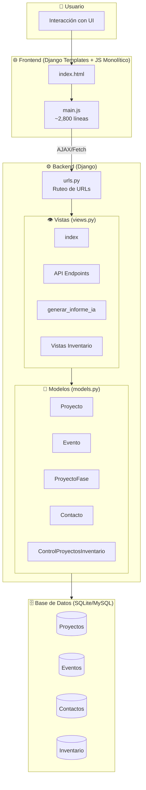

---

## Flujo de Autenticación

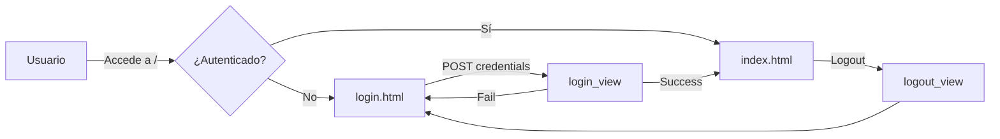

---

## Flujo de Gestión de Proyectos (CRUD)

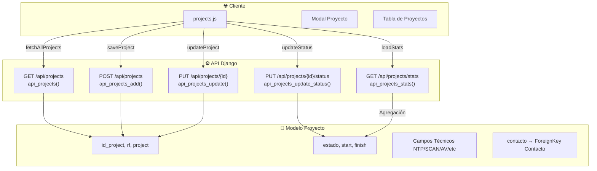

---

## Flujo de Gestión de Contactos

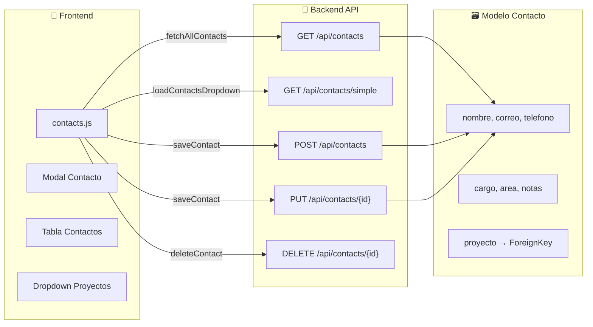

---

## Flujo de Gestión de Eventos (Calendario)

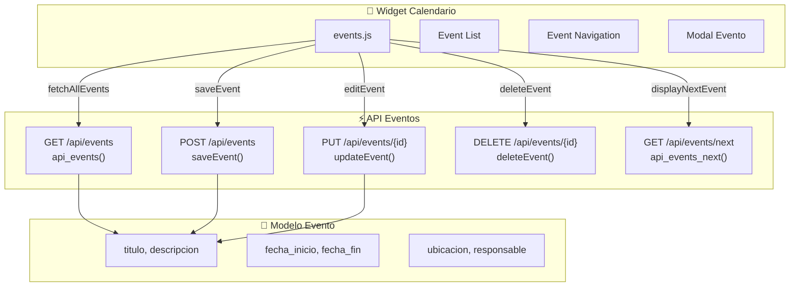

---

## Flujo del Dashboard y Estadísticas

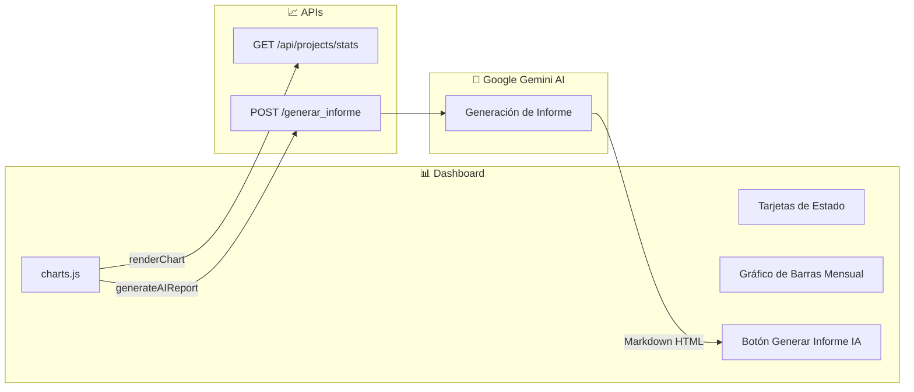

---

## Flujo de Gestión de Inventario

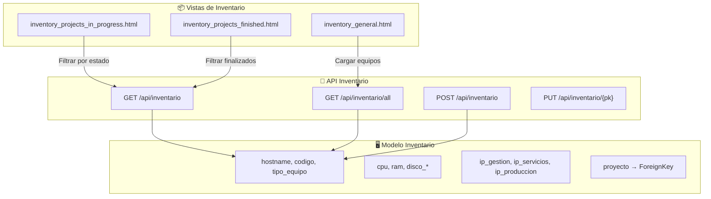

---

## Flujo de Fases de Proyecto (Histórico)

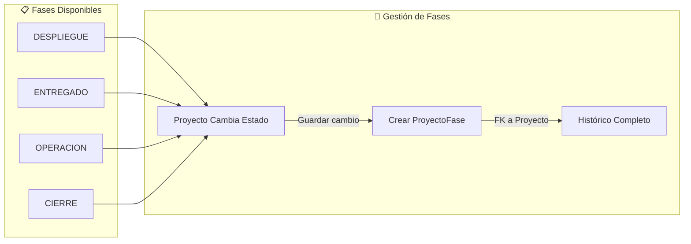

---

## Estructura de main.js (Monolítico)

El archivo `@d:\Share\app-web2\proyecto_control\static\js\main.js` contiene toda la lógica JavaScript en una sola pieza:

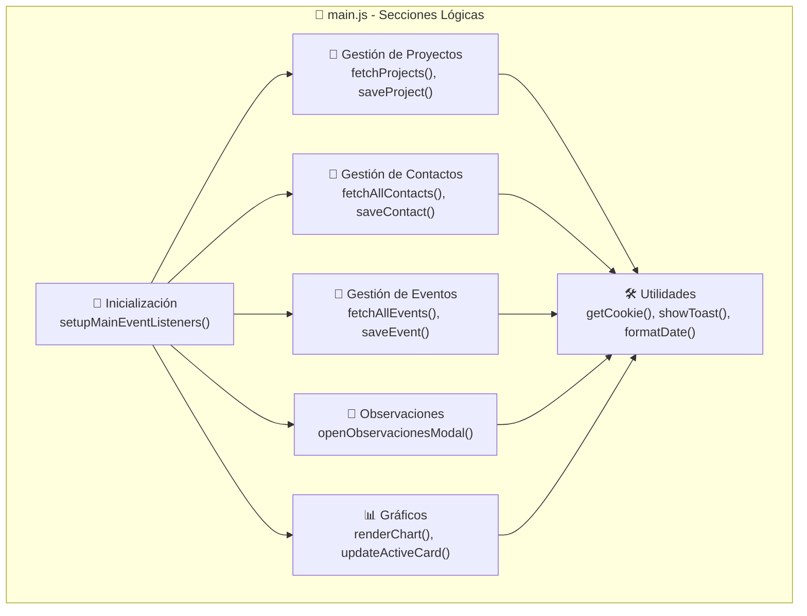

---

## Endpoints API RESTful

| Método | Endpoint | Función | Descripción |
|--------|----------|---------|-------------|
| GET | `/api/projects` | `api_projects()` | Listar todos los proyectos |
| POST | `/api/projects` | `api_projects_add()` | Crear nuevo proyecto |
| PUT | `/api/projects/{id}` | `api_projects_update()` | Actualizar proyecto |
| PUT | `/api/projects/{id}/status` | `api_projects_update_status()` | Actualizar estado/fase |
| GET | `/api/projects/stats` | `api_projects_stats()` | Estadísticas mensuales |
| GET | `/api/events` | `api_events()` | Listar eventos |
| POST | `/api/events` | `api_events()` | Crear evento |
| PUT | `/api/events/{id}` | `api_events_update()` | Actualizar evento |
| DELETE | `/api/events/{id}` | `api_events_update()` | Eliminar evento |
| GET | `/api/contacts` | `api_contacts()` | Listar contactos |
| POST | `/api/contacts` | `api_contacts()` | Crear contacto |
| GET | `/api/inventario` | `api_inventario()` | Listar inventario |
| POST | `/api/inventario` | `api_inventario()` | Crear equipo |
| POST | `/generar_informe` | `generar_informe_ia()` | Informe con Gemini AI |

---

## Relaciones entre Modelos (ERD Simplificado)

```mermaid
erDiagram
    PROYECTO ||--o{ PROYECTOFASE : "tiene historial"
    PROYECTO ||--o{ CONTACTO : "asociado"
    PROYECTO ||--o{ INVENTARIO : "contiene equipos"
    
    PROYECTO {
        int id_project PK
        string rf
        string project
        string estado
        date start
        date finish
        string computo
        string ntp, scan, antivirus
        int contacto_id FK
    }
    
    PROYECTOFASE {
        int id PK
        int proyecto_id FK
        string fase
        date fecha
    }
    
    CONTACTO {
        int id PK
        string nombre
        string correo
        string telefono
        string cargo
        int proyecto_id FK
    }
    
    INVENTARIO {
        int id PK
        string hostname
        string codigo
        string tipo_equipo
        string cpu, ram
        string ip_gestion
        int proyecto_id FK
    }
    
    EVENTO {
        int id PK
        string titulo
        text descripcion
        datetime fecha_inicio
        datetime fecha_fin
        string ubicacion
    }
```

---

## Secuencia de Carga de Página Principal

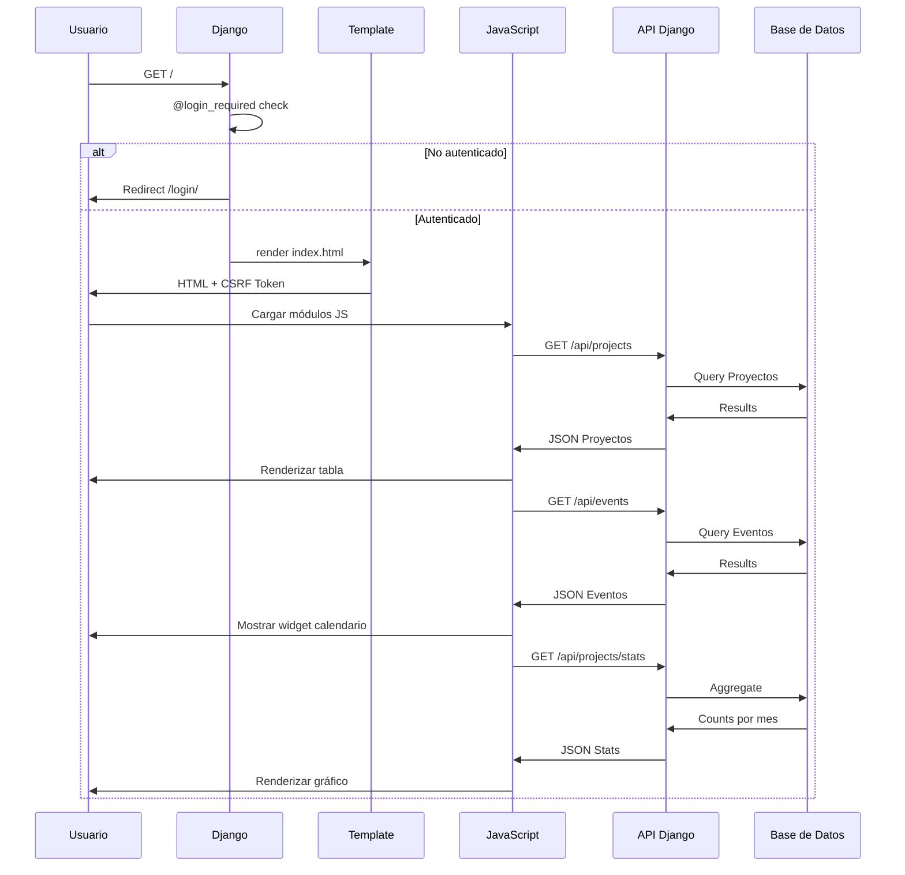

---

## Flujo de Datos - Guardar Proyecto

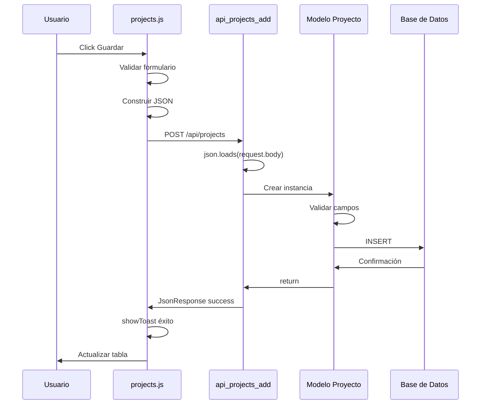

---

## Estructura de Directorios del Proyecto

```
proyecto_control/
├── 📁 proyecto_control/          # Configuración Django
│   ├── __init__.py
│   ├── settings.py               # Configuración principal
│   ├── urls.py                   # URLs raíz
│   ├── wsgi.py
│   └── asgi.py
│
├── 📁 control_proyectos/          # App principal
│   ├── models.py                 # 5 modelos
│   ├── views.py                  # ~1250 líneas
│   ├── urls.py                   # 18 endpoints
│   ├── admin.py                  # Config admin
│   ├── apps.py
│   └── migrations/
│
├── 📁 templates/                  # Templates HTML
│   ├── index.html                # App principal (~58KB)
│   ├── index_modular.html        # Versión modular
│   ├── login.html
│   ├── informe.html
│   └── inventory/                # Templates inventario
│
├── 📁 static/                     # Archivos estáticos
│   └── js/
│       └── modules/              # JS Modular
│           ├── utils.js          # Helpers (7.8KB)
│           ├── projects.js       # Gestión proyectos (30KB)
│           ├── contacts.js       # Gestión contactos (29KB)
│           ├── events.js         # Calendario (11KB)
│           ├── observaciones.js # Notas (9KB)
│           └── charts.js         # Gráficos (15KB)
│
├── 📁 config/                     # Configuración
├── 📁 scripts/                    # Scripts utilitarios
├── manage.py                      # CLI Django
├── requirements.txt               # Dependencias
└── .env                          # Variables entorno
```

---

## Resumen de Arquitectura

| Capa | Tecnología | Responsabilidad |
|------|------------|-----------------|
| **Presentación** | HTML5 + Bootstrap 5 + CSS3 | Interfaz de usuario responsive |
| **Lógica Cliente** | Vanilla JavaScript ES5/ES6 | **Monolítico**: main.js (~2,800 líneas) |
| **API** | Django 5.x + Django REST-style | Endpoints JSON para CRUD |
| **Lógica Negocio** | Django Views | Autenticación, validación, procesamiento |
| **Datos** | Django ORM | Modelos, relaciones, queries |
| **Persistencia** | SQLite (dev) / MySQL (prod) | Almacenamiento transaccional |
| **AI** | Google Gemini API | Generación de informes |

---

## Características Clave del Flujo (Realidad Actual)

1. **Arquitectura Monolítica**: Todo el JavaScript en un solo archivo `main.js`
2. **API RESTful**: Toda comunicación cliente-servidor vía JSON
3. **Carga Síncrona**: `main.js` se carga al final de `index.html` con versión cache-buster (`?v=1.6`)
4. **Stateless**: No hay estado de sesión en el servidor más allá de auth
5. **Integración AI**: Gemini para generación automática de informes
6. **Histórico de Fases**: Registro completo de cambios de estado por proyecto

## Deuda Técnica Identificada

| Issue | Descripción | Impacto |
|-------|-------------|---------|
| Código monolítico | `main.js` muy grande (~3,600 líneas) | Difícil mantenimiento, conflictos en merges |
| Cache busting manual | `?v=1.6` hardcodeado | Riesgo de caché obsoleta en clientes |
| Sin tests | No hay cobertura de tests unitarios | Riesgo de regresiones |
